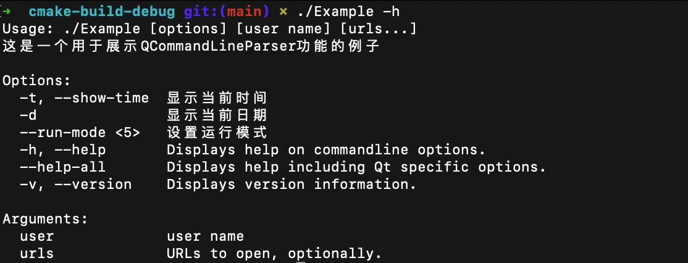
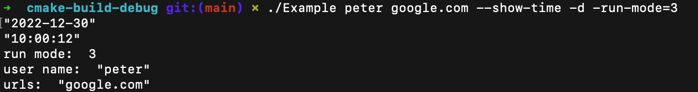

# QCommandLineParser

### 简介
&nbsp;&nbsp;&nbsp;&nbsp;&nbsp;&nbsp;&nbsp;&nbsp;&nbsp;QCommandLineParser 为开发者在基于 Qt 进行开发命令行程序或GUI程序需要使用到命令行的参数时提供了快捷的操作，省去了写Usage 以及复杂的读取参数的时间。
&nbsp;&nbsp;&nbsp;&nbsp;&nbsp;&nbsp;&nbsp;&nbsp;&nbsp;它能够处理短名称、长名称、同一选选的多个名称以及选项值
    
### 参数定义
* `选项`是以一个或者两个 "-" 开头的字符串  
    *  注意在单个 "-" 号时，是特殊情况，通常会被认为是标准输入而非一个选项
    *  解释器会对 "--" 号后的内容定义为`位置参数 (positional argument)`
    
* 所有 非 “ - ”开头的字符串（即非选项） 均被定义为`位置参数 (positional argument)`。   
* `短选项（short options）`即单个字母（例如`-v`）。Qt 默认的解析模式为`QCommandLineParser::ParseAsCompactedShortOptions`，该模式会读取紧凑形的短选项（如 -abc 等价于 -a, -b, -c）, 如将解析模式设置为 `QCommandLineParser::ParseAsLongOptions`，则`-abc`将被视为是一个`长选项`
* `长选项（long options）`即超过一个字符且无法变为紧凑型的字符串。如verbose选项可以表现为 --verbose 或 -verbose
* `位置参数 (positional argument)` 可以通过在选项后加上一个 空格(` `)或者加上一个等号(`=`)进行赋值 如定义一个选项为选择模式(定义选项为m 或 mode) 则可通过以下四种方式进行赋值`-m value` ,`-m=value` ,`--mode value `,`--mode=value`。
* 并不支持可选值，即如果一个选项设置了需要一个值，则必须有值，如果该选项放到了最后，则视为未指定
* 解释器没有默认自动支持否定以及禁用长选项(--disable-option 和 --no-option)。如果需要这种情况，我们需显示的在代码中定义这种选项。

### Example
运行同级目录下的Example 用例，用例以CMake工程实现
`./Example -h`

`./Example peter google.com --show-time -d -run-mode=3`

